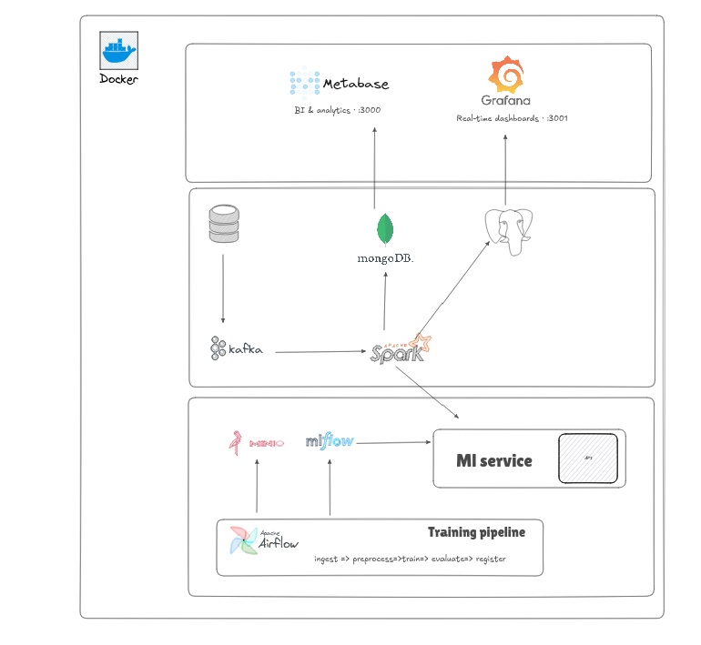
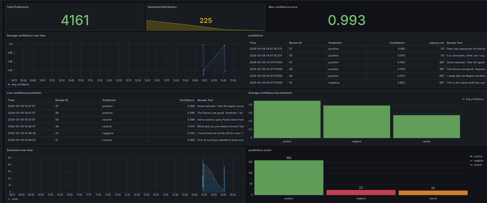
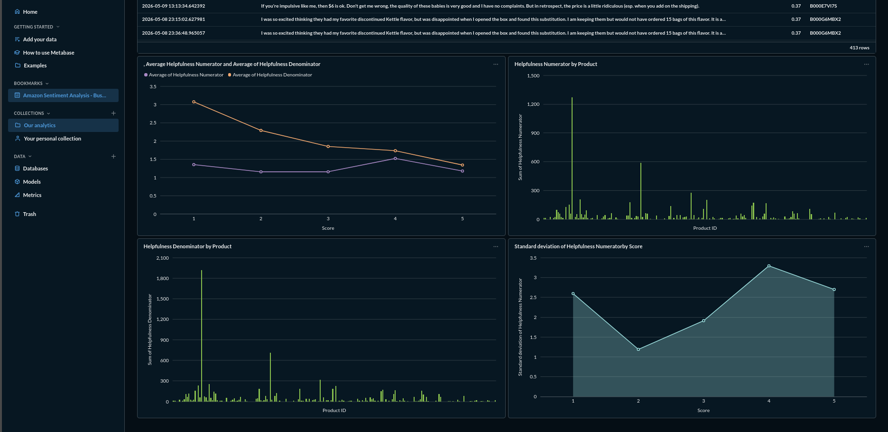
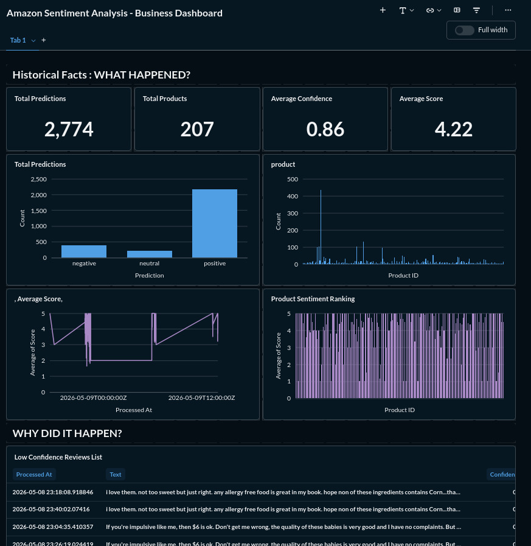

# Amazon Sentiment Analysis Platform

A comprehensive real-time NLP streaming pipeline for sentiment analysis on Amazon product reviews, featuring MLOps integration, scalable architecture, and interactive dashboards.

##  Features

- **Real-time Streaming**: Ingest and process Amazon review data in real-time using Kafka and Spark Streaming
- **ML Inference**: Perform sentiment analysis using pre-trained RoBERTa models served via FastAPI
- **MLOps Pipeline**: Complete model lifecycle management with MLflow, including training, versioning, and deployment
- **Data Visualization**: Interactive dashboards with Grafana and Metabase for real-time and historical analytics
- **Scalable Architecture**: Containerized services with Docker Compose for easy deployment
- **Monitoring & Observability**: Built-in logging, metrics collection, and model performance tracking

## Architecture

The platform consists of three main layers:

### System Architecture Diagram


### Real-Time Processing Plane
```
Data Source → Kafka → Spark Streaming → ML Service → MongoDB → Dashboards
```

### Batch/Control Plane
```
Airflow → Spark Batch → Model Training → MLflow → ML Service
       → Data Aggregation → PostgreSQL → Dashboards
```

### Key Components
- **Apache Kafka**: Event streaming backbone
- **Apache Spark**: Real-time data processing and batch training
- **FastAPI**: Model serving with REST API
- **MongoDB**: Operational storage for real-time data
- **PostgreSQL**: Analytical storage for historical data
- **MLflow**: Model tracking and registry
- **Airflow**: Workflow orchestration
- **Grafana/Metabase**: Data visualization dashboards

##  Prerequisites

- Docker and Docker Compose
- Python 3.8+ (for local development)
- Git

##  Installation

1. **Clone the repository**
   ```bash
   git clone <repository-url>
   cd amazon_sentiment_analysis
   ```

2. **Set up environment variables**
   
    create .env
   

   Add the following required variables to `.env`:
   ```env
   POSTGRES_USER=your_postgres_user
   POSTGRES_PASSWORD=your_postgres_password
   POSTGRES_DB=your_postgres_db
   AIRFLOW_DB=your_airflow_db
   MLFLOW_DB=your_mlflow_db
   METABASE_DB=your_metabase_db
   MINIO_ROOT_USER=your_minio_user
   MINIO_ROOT_PASSWORD=your_minio_password
   MLFLOW_S3_ENDPOINT_URL=http://minio:9000
   MLFLOW_TRACKING_URI=http://mlflow:5000
   AIRFLOW_FERNET_KEY=your_generated_fernet_key
   AIRFLOW_SECRET_KEY=your_airflow_secret
   AIRFLOW_ADMIN_USER=admin
   AIRFLOW_ADMIN_PASSWORD=admin
   GRAFANA_ADMIN_USER=admin
   GRAFANA_ADMIN_PASSWORD=admin
   MODEL_NAME=sentiment_model
   MODEL_STAGE=Production
   MONGO_DB=sentiment_db
   ```

   Generate Airflow Fernet key:
   ```bash
   python -c "from cryptography.fernet import Fernet; print(Fernet.generate_key().decode())"
   ```

3. **Start the platform**
   ```bash
   docker compose up -d
   ```

##  Usage

### Verify Services
Check these endpoints to ensure all services are running:

- **FastAPI Model Service**: http://localhost:8000/health
- **Spark UI**: http://localhost:8080
- **Airflow**: http://localhost:8081
- **MLflow**: http://localhost:5000
- **MinIO Console**: http://localhost:9001
- **Grafana**: http://localhost:3001
- **Metabase**: http://localhost:3000

### Run Model Training
1. Open Airflow at http://localhost:8081
2. Enable and trigger the `model_training_pipeline` DAG

### Test Sentiment Analysis
```bash
curl -X POST "http://localhost:8000/predict" \
     -H "Content-Type: application/json" \
     -d '{"text": "This product is amazing!"}'
```

### View Dashboards
- **Grafana**: Real-time metrics and visualizations
- **Metabase**: Historical analytics and custom dashboards

#### Real-Time Dashboard (Grafana)


#### Analytics Dashboard (Metabase)




##  Project Structure

```
amazon_sentiment_analysis/
├── dags/                    # Airflow DAGs
├── docker-compose.yml       # Docker Compose configuration
├── frontend/                # Web dashboards
├── grafana/                 # Grafana dashboards and provisioning
├── init-db/                 # Database initialization scripts
├── logs/                    # Application logs
├── metabase/                # Metabase configuration
├── ml-service/              # FastAPI model serving service
├── plugins/                 # Custom plugins
├── research/                # Research notebooks and experiments
├── spark-jobs/              # Spark streaming jobs
├── streaming-service/       # Kafka consumer and producer services
├── training-pipeline/       # Model training pipeline
└── README.md
```
## team members
- Hamdan Kaouthar
- AMAMI YOUSRA
- Hahati Oumaima
- Rayane Mahmoud

##  Development

### Local Development Setup
1. Install Python dependencies for each service
2. Set up local databases (PostgreSQL, MongoDB)
3. Configure environment variables for local development
4. Run services individually or use Docker Compose

### Adding New Features
- Follow the modular architecture
- Update Docker configurations
- Add tests for new components
- Update documentation

##  Contributing

1. Fork the repository
2. Create a feature branch
3. Make your changes
4. Add tests if applicable
5. Submit a pull request

## License

This project is licensed under the MIT License - see the [LICENSE](LICENSE) file for details.


## Additional Documentation

- [How to Run](HOW_TO_RUN.md) - Detailed setup and running instructions
- [Environment Setup](ENVIRONMENT_SETUP.md) - Architecture and configuration details
- [Project Structure](PROJECT_STRUCTURE.md) - Detailed component descriptions
- [Progress Summary](PROGRESS_SUMMARY.md) - Development progress and milestones
